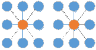
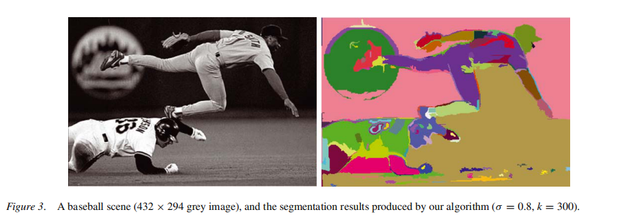
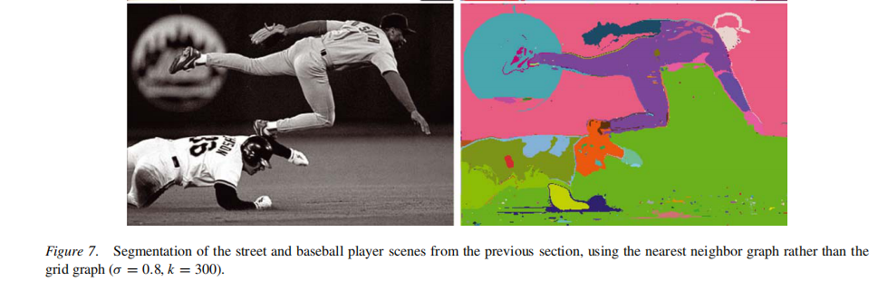

# Efficient Graph-based Segmentation

这里介绍一种基于图（graph-based）的图像分割方法。此方法的关注点在于：能够选取出视觉上的重要区域（perceptually important groupings），即人们肉眼观察能得到的分割区域；同时能够实现高效运算，时间复杂度与图的像素点呈线性关系。接下来具体介绍一下算法的实现，如果想了解具体的证明以及相关工作可以去阅读原论文：P. F. Felzenszwalb and D. P. Huttenlocher. Efficient Graph-Based Image Segmentation. IJCV, 59:167-181, 2004.

## 1. 图的建立

我们定义图$$G\in (V,E)$$，顶点集V代表了所有的像素点集合，边集$$(v_i,v_j)\in E$$ 代表了相邻点之间边的集合，每条边对应着$$w(v_i,v_j)$$，即边的权重，代表了$$v_i,v_j$$两点间的不相似度，下文将会根据权重来处理区域的边界问题。

### 1.1 边的建立

论文中讲述了两种方法分别是：基于Gird Graphs 和 基于 Nearest Neighbor Graphs

#### 1.1.1 Gird Graphs 

首先连接每个顶点的8-邻域或者4-邻域作为边（如下图)：

然后将灰度值(intensity)的差作为边的权重：$$w(v_i,v_j)=|I(p_i)-I(p_j)|$$，本文在进行权重计算前需要先用高斯滤镜（$\sigma=0.8$）进行平滑处理，来减少图片的噪声，有利于后续处理。对于RGB类型的彩色图像：

1. 既可以通过分别对R，G，B三通道进行处理，然后进行合并，这里注意合并的标准是：只有两个像素点在三个颜色的分割结果中都属于同一个区域，那么才将他们划分在一起。
2. 也可以通过将边的权重设为与颜色有关，然后运行算法一次。这里可以将$$w(v_i,v_j )$$设为颜色的距离即$$\sqrt{(r_i-r_j)^2+(g_i-g_j)^2+(b_i-b_j)^2}$$

实验表明，第一种方法的效果要好一些，当然两种方法都能实现分割效果。

#### 1.1.2 Nearest Neighbor Graphs

Gird Graphs 只有相邻的会进行比较，也就是说如果相隔较远但是颜色较近的像素点将会被忽略导致被分到不同的区域中，因此这个方法将像素点$$(x,y)$$映射到特征空间$$(x,y,r,g,b)$$，以$$L2$$距离作为边的权重用ANN算法找出最近的10个邻居，然后建立边。

下图分别给出了使用上面两个不同方法产生的结果

## 2. 区域之间的边界判断

在进行具体的算法实现前，需要先提出一些概念以及定义。

首先先定义一个$$D(C_1,C_2)$$函数，用来判断两个区域（regions）$$C_1,C_2$$之间是否存在边界，即能否划为同一个部分。在具体定义之前，需要先定义几个概念

- internal difference 内部差异：即分割区域$$C$$的内部差异，用此区域的最小生成树（MST(C,E)）中最大的边权，公式如下
  $$
  Int(C)=\max \limits_{e\in MST(C,E)} w(e)
  $$

- difference between C1,C2 两个区域的差异：用连接两区域的边中最小的边权，公式如下
  $$
  Dif(C_1,C_2)=\min \limits_{v_i\in C_1,v_j\in C2,(v_i,v_j)\in E} w(v_i,v_j)
  $$
  如果不存在连接C1,C2的边，那Dif为无穷大

  此处也可以使用分位数（quantile），如中位数等，但是问题将变为NP难问题，论文的附录中有对此的讨论。

- minimum internal difference : 
  $$
  MInt(C_1,C_2)=min(Int(C_1)+\tau(C_1),Int(C_2)+\tau(C_2))
  $$
  

  其中$\tau(C) = \frac{k}{|C|}$，此处|C|指分割区域点的个数，k是参数，可以根据不同需求进行调节。

  阈值函数$\tau(C)$， 控制分割区域边界的定义。比较直观的理解，小分割区域的边界定义要强于大分割区域，否则可以将小分割区域继续合并形成大区域。在一定程度上k值的大小也可以控制最后分割区域的规模大小。

  

最后可以得出D函数：
$$
D(C_1,C_2)=\begin{cases}true &\text{if Dif(C_1,C_2)>MInt(C_1,C_2)} \\ false &\text{otherwise} \end{cases}
$$
即如果两个区域的外部差异仍大于两个区域中较小的内部差异，那么此两个区域中存在边界

## 3. 算法的实现

输入：$G\in (V,E)$，点集大小为n，边集大小为m

输出：分割区域集合$S=(C_1,……,C_r)$

运行步骤：

1. 将边集E排序成不下降序列$\pi = (o_1,……,o_m)$
2. 将$S_0$初始化为每个点都位于自己的区域中，即初始的每个分割区域都只含有一个元素
3. for q = 1 to m 重复步骤4 
4. $v_i,v_j$为边$o_q$连接的两个点，如果这两点位于不同的分割区域$C_i,C_j$，而且满足$w(o_q)\leqslant MInt(C_i,C_j)$（由于边集已经进行排序，因此$w(o_q)=Dif(C_i,C_j)$），那么将$C_i,C_j$合并，否则$S_q = S_{q-1}$，
5. 返回$S_m$

