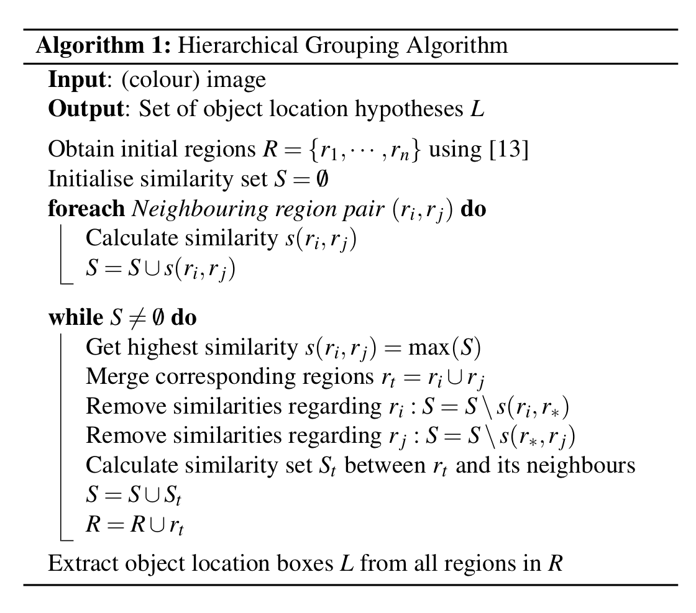
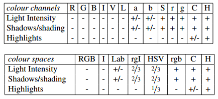
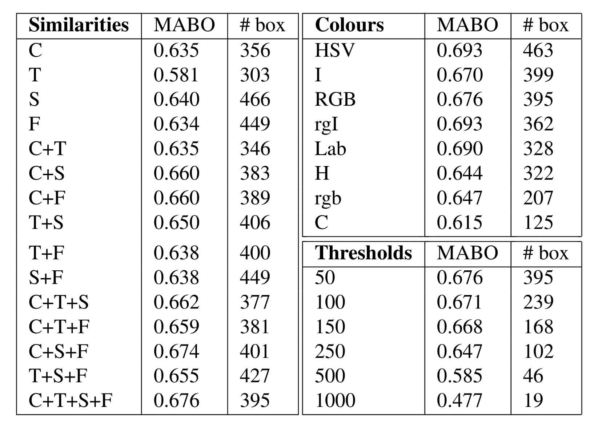

# Selective-search

选择性搜索（Selective search）是用于将**图像划分**为可能是某可识别对象（object）的一系列区域，然后进行进一步的图像识别。

选择性搜索具有如下的特征：

1. 选取**所有规模**大小的图像进行判断
2. 通过比较**多方面**的特征来进行区域的划分
3. 保证计算的**快速**

## 1. Hierarchical Grouping 

Selective search采用**层次性的分组**方法来实现选取到所有规模大小的图像。同时，为了能够更高效地进行区域划分，这里选取已经进行过小区域划分的图像（理想上不覆盖多个对象）作为初始。

算法流程：

1. 使用`Efficient Graph-based Segmentation`创建初始区域R
2. 计算所有邻居区域之间的相似度 $s(r_i,r_j)$
3. 将相似度最高的两个区域 $r_i,r_j$ 合并为 $r_t$ ，将合并后的区域加入R中
4. 更新合并后的区域相似度，这里$r_t$的特征值只需通过 $r_i$ 和 $r_j$ 的特征值来进行计算
5. 重复步骤3,4，直到图像变为一整个区域
6. 最后从R中提取所求分割区域

## 2. Diversification Strategies

### 2.1 Complementary Color Spaces

我们需要考虑不同的场景和照明条件，因此我们通过**颜色空间变换**，使用多种颜色空间来提高**颜色不变性**，减少外界条件对图像的影响。下表列出了在不同的颜色空间下的特定的不变属性

>"+/-"表示部分不变性，分数1/3表示三个颜色通道中的一个对上述性质是不变的

### 2.2 Complementary Similarity Measures

我们定义了四种互补的、快速的相似度计算方法。每种方法都将相似度的值归一化到[0,1]，促进了这些方法的结合。

1. $S_{color}(r_i,r_j)$（计算颜色相似度）：对于每个区域，建立每个颜色通道`bins`=25的`one-dimensional`**颜色直方图 **$C_i=\{c_{i1},...,c_{in}\}$，对于三种颜色通道$n=75$. 颜色直方图使用$L1\ norm$进行标准化。相似度为：
   $$
   s_{color}(r_i,r_j) = \sum_{k=1}^n \min(c_{ik},c_{jk})
   $$
   区域合并后：
   $$
   C_t = \frac{size(r_i)*C_i+size(r_j)*C_j}{size(r_i)+size(r_j)}\\size(r_t)=size(r_i)+size(r_j)
   $$

2. $S_{texture}(r_i,r_j)$(计算纹理相似度)：对于每个区域，每个颜色通道的８个方向使用$\sigma=1$的高斯微分，并每个方向抽取bins=10的直方图(实现，多次旋转图像计算导数)
3. $S{size}(r_i,r_j)$：使较小的区域尽早合并
4. $S{fill}(r_i,r_j)$(计算区域之间的空隙)

### 2.3 Complementary Starting Regions

可得以`Efficient Graph-based Segmentation`作为初始划分是最快的方式

## 3. Combining Locations

以区域被合并的顺序，乘上随机数RAN，作为判断区域有效性的依据

## 4. MABO

